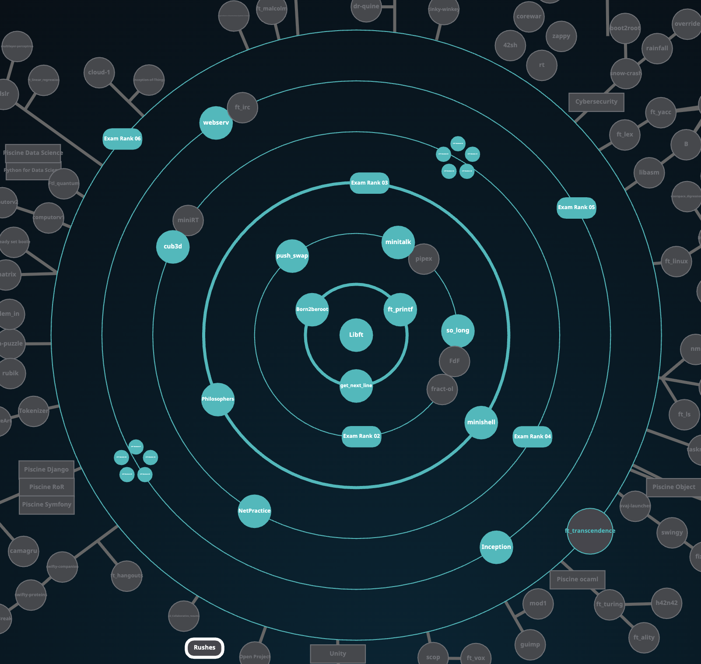

# 📘 42 Common Core Project Overview

> A summary table of all projects I have completed during the 42 Common Core program.

| Rank | Project           | Type  | Description                                                        | Language/Tools     | Status |
| ---- | ----------------- | ----- | ------------------------------------------------------------------ | ------------------ | ------ |
| 00   | Libft             | Solo  | Custom implementation of standard C functions and linked lists     | C                  | ✅ Done |
| 01   | get\_next\_line   | Solo  | Read lines from a file descriptor, handling buffer memory manually | C                  | ✅ Done |
| 01   | ft\_printf        | Solo  | Recreate printf with variadic functions and format parsing         | C                  | ✅ Done |
| 01   | Born2BeRoot       | Solo  | System administration project using Debian and virtual machines    | Bash, VM, Debian   | ✅ Done |
| 02   | minitalk          | Solo  | Message transmission between processes using Unix signals          | C, signals         | ✅ Done |
| 02   | so\_long          | Solo  | Build a 2D game using MiniLibX graphics library                    | C, MiniLibX        | ✅ Done |
| 02   | push\_swap        | Solo  | Sorting algorithm challenge with limited operations                | C                  | ✅ Done |
| 03   | philosophers      | Solo  | Multithreaded solution to dining philosophers problem              | C, pthreads        | ✅ Done |
| 03   | minishell         | Group | Unix shell with parsing, redirection, and built-ins                | C                  | ✅ Done |
| 04   | netpractice       | Solo  | Practice IPv4 networking and subnetting                            | Networking tools   | ✅ Done |
| 04   | cub3D             | Group | 3D raycasting game engine                                          | C, MiniLibX        | ✅ Done |
| 04   | C++ Modules 00-04 | Solo  | OOP basics, inheritance, overloading, exceptions                   | C++                | ✅ Done |
| 05   | C++ Modules 05-09 | Solo  | Advanced C++ (templates, STL, file IO)                             | C++                | ✅ Done |
| 05   | webserv           | Group | HTTP server implementation from scratch (RFC-compliant)            | C++                | ✅ Done |
| 05   | inception         | Solo  | Docker-based setup with WordPress, NGINX, MariaDB                  | Docker, Linux      | ✅ Done |
| 06   | ft\_transcendence | Group | Full-stack web app with multiplayer Pong game                      | TypeScript, NestJS | ✅ Done |

---

✅ All projects listed above were successfully completed as part of the 42 Common Core curriculum.
